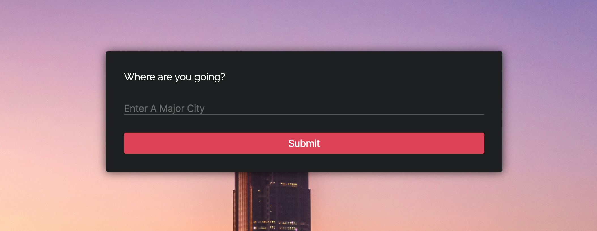
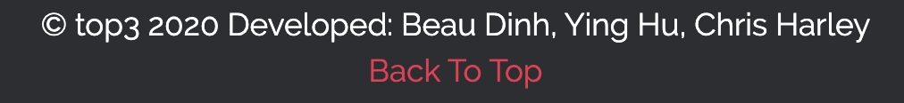

# Project Name: top3

## Group Project By:

###### - Chris Harley
###### - Ying Hu
###### - Beau Dinh

**The purpose of 'top3' is to return the top 3 results of Restaurants, Hotels, Tours, Sightseeing, and Nightlife of the user input location.**

**Home Page** - when the user inputs a location. 'top3' will search the API according to the user input and return the results on the next page. the submit button will change to "loading", the background will load a picture of the result; after 2 seconds, a new result page will load.

**Result page** - left 50% of the screen is the results and the other 50% of the screen is a google map.
The top portion of the result page will display a picture of the location, following by the name of the location, country, and score rating from the API. An about section can be read in the same section.

There will be 5 cards showing the top 3 of the results of the restaurants, hotels, tours, sightseeing, and nightlife. for example, the top 3 restaurants contain names of the restaurants and score ratings. Top 3 hotels contain names of the hotels and scores, so forth.

The map obtains the coordinates from the API and displays the location accordingly.

Lastly, we also included a footer on the bottom of 'top3' with an option to click to go back to the top. 

